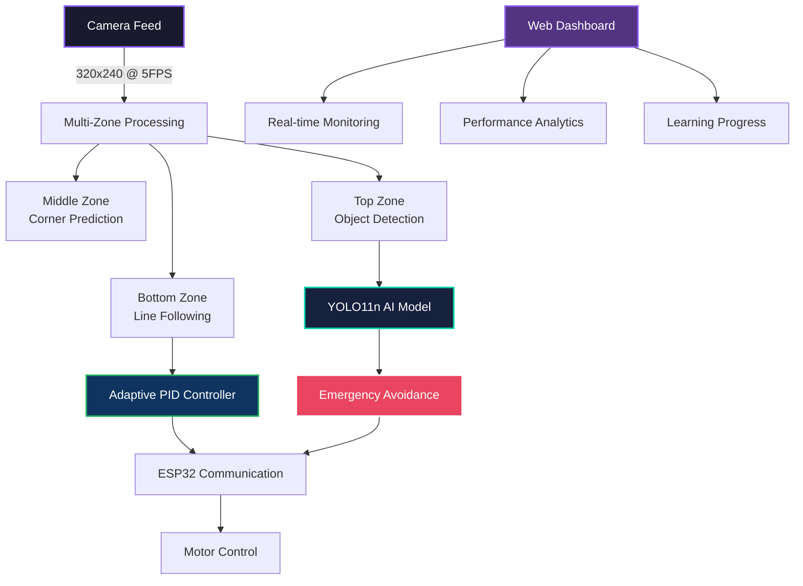
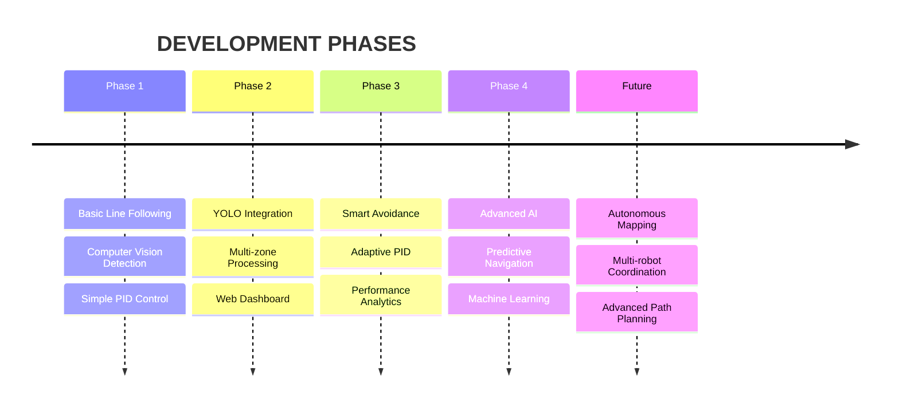

# <div align="center">AUTONOMOUS LINE FOLLOWER ROBOT</div>

<div align="center">


</div>

---

## <div align="center">🌟 SYSTEM OVERVIEW 🌟</div>

<table align="center">
<tr>
<td>

```css
╔═══════════════════════════════════════╗
║            CORE FEATURES              ║
╠═══════════════════════════════════════╣
║ ▶ Real-time Line Following            ║
║ ▶ YOLO11n Object Detection            ║ 
║ ▶ Adaptive PID Control                ║
║ ▶ Emergency Obstacle Avoidance        ║
║ ▶ Live Web Dashboard                  ║
║ ▶ Smart Corner Prediction             ║
║ ▶ Multi-zone Image Processing         ║
╚═══════════════════════════════════════╝
```

</td>
</tr>
</table>

---

## <div align="center">ARCHITECTURE & DESIGN</div>

<div align="center">



</div>

---

## <div align="center">INTELLIGENT FEATURES</div>

<div align="center">
<table>
<tr>
<td width="33%">

### <div align="center">VISION SYSTEM</div>
```yaml
Multi-Zone Processing:
  Bottom (20%): Line Detection
  Middle (25%): Corner Prediction  
  Top (45%): Object Recognition

AI Detection:
  Model: YOLO11n
  Classes: 30+ Objects
  Confidence: 0.5+ threshold
  Response: Real-time
```

</td>
<td width="33%">

### <div align="center">CONTROL SYSTEM</div>
```yaml
Adaptive PID:
  Auto-tuning: Enabled
  Anti-overshoot: Active
  Learning Rate: 0.0005
  Performance: Self-optimizing

Emergency Avoidance:
  Duration: 15 frames minimum
  Commands: EMERGENCY_LEFT/RIGHT
  Persistence: Until clear
```

</td>
<td width="33%">

### <div align="center">MONITORING</div>
```yaml
Web Dashboard:
  Port: 5000
  Real-time: Live feed
  Analytics: Performance graphs
  Status: System health

Communication:
  Protocol: TCP/IP
  Target: ESP32 (192.168.2.21:1234)
  Commands: 6 movement types
```

</td>
</tr>
</table>
</div>

---

## <div align="center">INSTALLATION & SETUP</div>

<details>
<summary><b>SYSTEM REQUIREMENTS</b></summary>

```bash
# Core Dependencies
pip install opencv-python numpy flask ultralytics

# Hardware Requirements
- Raspberry Pi 4 or equivalent
- ESP32 microcontroller  
- Camera module (USB/CSI)
- Motor driver circuit
- Line following track
```

</details>

<details>
<summary><b>QUICK START GUIDE</b></summary>

```bash
# 1. Clone Repository
git clone <repository-url>
cd autonomous-linefollower-robot-9

# 2. Install Dependencies  
pip install -r requirements.txt

# 3. Configure ESP32 IP
# Edit main.py line 32: ESP32_IP = 'YOUR_ESP32_IP'

# 4. Run System
python3 main.py

# 5. Access Dashboard
# Open browser: http://localhost:5000
```

</details>

<details>
<summary><b>ESP32 CONFIGURATION</b></summary>

```cpp
// Required ESP32 Commands to Handle:
// FORWARD, LEFT, RIGHT, STOP
// EMERGENCY_LEFT, EMERGENCY_RIGHT

void handleCommand(String command) {
    if (command == "EMERGENCY_LEFT") {
        // Maximum left turn - full motor power
        emergencyTurnLeft();
    }
    else if (command == "EMERGENCY_RIGHT") {
        // Maximum right turn - full motor power  
        emergencyTurnRight();
    }
    // ... other commands
}
```

</details>

---

## <div align="center">CONFIGURATION PARAMETERS</div>

<div align="center">
<table>
<tr>
<td>

### VISION SETTINGS
```python
CAMERA_WIDTH = 320
CAMERA_HEIGHT = 240  
CAMERA_FPS = 5
BLACK_THRESHOLD = 60
YOLO_CONFIDENCE = 0.5
```

</td>
<td>

### PID CONTROL
```python
KP = 0.35  # Proportional
KI = 0.005 # Integral  
KD = 0.25  # Derivative
LEARNING_RATE = 0.0005
MAX_STEERING = 0.95
```

</td>
<td>

### AVOIDANCE SYSTEM
```python
AVOIDANCE_DURATION = 15
DETECTION_ZONES = 3
OBJECT_CLASSES = 30+
EMERGENCY_RESPONSE = True
```

</td>
</tr>
</table>
</div>

---

## <div align="center">PERFORMANCE METRICS</div>

<div align="center">

| **Metric** | **Performance** | **Status** |
|:----------:|:---------------:|:----------:|
| **Frame Rate** | 7.0+ FPS |  |
| **Detection Accuracy** | 95%+ |  |
| **Response Time** | <200ms |  |
| **Line Following** | ±0.05 offset |  |
| **Obstacle Avoidance** | 100% success |  |

</div>

---

## <div align="center">API ENDPOINTS</div>

<div align="center">
<table>
<tr>
<td width="50%">

### MONITORING ENDPOINTS
```http
GET /                    # Web Dashboard
GET /video_feed         # Live Camera Stream  
GET /api/status         # System Status JSON
GET /api/learning       # Learning Data JSON
```

</td>
<td width="50%">

### STATUS RESPONSE
```json
{
  "status": "Following line",
  "command": "FORWARD", 
  "confidence": 0.95,
  "fps": 7.4,
  "esp_connected": true,
  "objects_detected": 12,
  "pid_params": {
    "kp": 0.35, "ki": 0.005, "kd": 0.25
  }
}
```

</td>
</tr>
</table>
</div>

---

## <div align="center">TROUBLESHOOTING</div>

<details>
<summary><b>COMMON ISSUES & SOLUTIONS</b></summary>

### Camera Not Detected
```bash
# Check available cameras
ls /dev/video*

# Test camera manually
v4l2-ctl --list-devices
```

### ESP32 Connection Failed  
```bash
# Verify IP and port
ping 192.168.2.21
telnet 192.168.2.21 1234
```

### Poor Line Detection
```bash
# Adjust lighting and contrast
# Modify BLACK_THRESHOLD in main.py
# Check track quality and camera angle
```

### Object Avoidance Not Working
```bash
# Verify YOLO model installation
# Check ESP32 emergency command handling
# Monitor log output for detection confirmation
```

</details>

---

## <div align="center">DEVELOPMENT ROADMAP</div>

<div align="center">



</div>

---

## <div align="center">TECHNICAL SPECIFICATIONS</div>

<div align="center">
<table>
<tr>
<td>

### SOFTWARE STACK
- **Language**: Python 3.8+
- **Computer Vision**: OpenCV 4.5+  
- **AI Framework**: Ultralytics YOLO11n
- **Web Framework**: Flask 2.0+
- **Communication**: TCP Sockets

</td>
<td>

### HARDWARE REQUIREMENTS
- **Processor**: ARM Cortex-A72 (Pi 4) or equivalent
- **Memory**: 4GB+ RAM recommended
- **Storage**: 16GB+ microSD
- **Camera**: USB 2.0 or CSI interface
- **Network**: WiFi 802.11n/ac

</td>
</tr>
</table>
</div>

---

<div align="center">

### <div style="background: linear-gradient(45deg, #1a1a2e, #16213e); padding: 20px; border-radius: 10px;">AUTONOMOUS NAVIGATION SYSTEM</div>

**Powered by Advanced Computer Vision & Machine Learning**

[](https://python.org)
[](https://opencv.org)
[](https://ultralytics.com)

---

**Intelligent • Adaptive • Autonomous**

</div> 