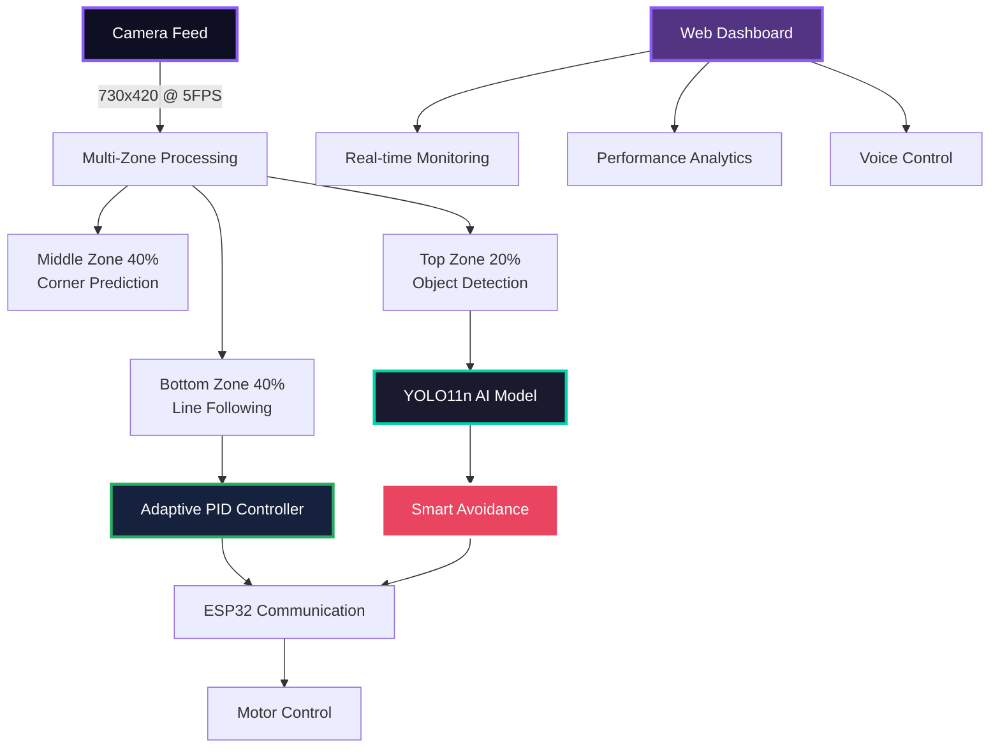
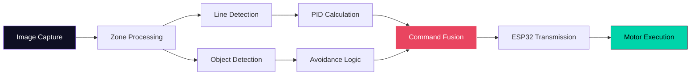

<div align="center">

# AUTONOMOUS LINE FOLLOWER ROBOT


</div>

---

## <div align="center">CORE FEATURES</div>

<table align="center">
<tr>
<td>

```css
╔═══════════════════════════════════════╗
║         INTELLIGENT CAPABILITIES     ║
╠═══════════════════════════════════════╣
║ ▶ Real-time Line Following            ║
║ ▶ YOLO11n Object Detection            ║ 
║ ▶ Adaptive PID Control                ║
║ ▶ Smart Obstacle Avoidance            ║
║ ▶ Live Web Dashboard                  ║
║ ▶ Voice Feedback System               ║
║ ▶ Multi-zone Image Processing         ║
║ ▶ ESP32 Wireless Control              ║
╚═══════════════════════════════════════╝
```

</td>
</tr>
</table>

---

## <div align="center">SYSTEM ARCHITECTURE</div>

<div align="center">



</div>

---


---

## <div align="center">QUICK START</div>

<details>
<summary><b>PREREQUISITES</b></summary>

```bash
# System Requirements
- Python 3.8+
- OpenCV 4.5+
- ESP32 microcontroller
- Camera (USB/CSI)
- WiFi network connection
```

</details>

<details>
<summary><b>INSTALLATION</b></summary>

```bash
# 1. Clone Repository
git clone <repository-url>
cd autonomous-linefollower-robot-8

# 2. Install Dependencies
pip install opencv-python numpy flask ultralytics

# 3. Configure ESP32 IP
# Edit tests/main.py line 49:
ESP32_IP = '192.168.128.117'  # Your ESP32 IP

# 4. Launch System
python3 tests/main.py

# 5. Access Dashboard
# Browser: http://localhost:5000
```

</details>

<details>
<summary><b>ESP32 SETUP</b></summary>

```cpp
// Required ESP32 Command Handler
void handleCommand(String command) {
    if (command == "FORWARD") {
        moveForward();
    }
    else if (command == "LEFT") {
        turnLeft();
    }
    else if (command == "RIGHT") {
        turnRight();
    }
    else if (command == "STOP") {
        stopMotors();
    }
}
```

</details>

---

## <div align="center">CONFIGURATION MATRIX</div>

<div align="center">
<table>
<tr>
<td width="33%">

### VISION SYSTEM
```python
CAMERA_WIDTH = 730
CAMERA_HEIGHT = 420
CAMERA_FPS = 5
BLACK_THRESHOLD = 60
YOLO_CONFIDENCE = 0.4
```

</td>
<td width="33%">

### PID CONTROL
```python
KP = 0.25    # Proportional
KI = 0.001   # Integral
KD = 0.12    # Derivative
LEARNING_RATE = 0.0005
MAX_STEERING = 0.8
```

</td>
<td width="33%">

### AVOIDANCE SYSTEM
```python
OBJECT_DETECTION = True
SMART_AVOIDANCE = True
AVOIDANCE_DURATION = 15
TURNAROUND_FRAMES = 200
SAFETY_MARGIN = 1.5
```

</td>
</tr>
</table>
</div>

---

## <div align="center">INTELLIGENT PROCESSING</div>

<div align="center">

### Multi-Zone Vision Processing

| Zone | Coverage | Function | Priority |
|:----:|:--------:|:--------:|:--------:|
| **Bottom** | 40% | Line Detection |  |
| **Middle** | 40% | Corner Prediction |  |
| **Top** | 20% | Object Detection |  |

### Control Flow Pipeline



</div>

---

## <div align="center">WEB DASHBOARD</div>

<div align="center">
<table>
<tr>
<td width="50%">

### LIVE MONITORING
```http
GET /                    # Main Dashboard
GET /video_feed         # Camera Stream
GET /api/status         # System Status
GET /api/voices         # Voice Options
```

</td>
<td width="50%">

### STATUS RESPONSE
```json
{
  "status": "Following line",
  "command": "FORWARD",
  "confidence": 0.95,
  "fps": 5.2,
  "esp_connected": true,
  "objects_detected": 3,
  "pid_params": {
    "kp": 0.25, "ki": 0.001, "kd": 0.12
  }
}
```

</td>
</tr>
</table>
</div>

---

## <div align="center">ADVANCED FEATURES</div>

<div align="center">
<table>
<tr>
<td width="50%">

### SMART OBSTACLE AVOIDANCE
- Multi-strategy avoidance algorithms
- Obstacle memory and learning
- Distance estimation using monocular vision
- Adaptive path planning
- Emergency turnaround maneuvers

### ADAPTIVE CONTROL
- Self-tuning PID parameters
- Performance-based learning
- Dynamic response adjustment
- Anti-windup protection
- Real-time optimization

</td>
<td width="50%">

### VOICE SYSTEM
- Neural voice synthesis with Piper
- Multiple voice personalities
- Real-time status announcements
- Configurable voice selection
- Fallback TTS support

### COMMUNICATION
- TCP/IP wireless control
- ESP32 integration
- Command acknowledgment
- Connection monitoring
- Automatic reconnection

</td>
</tr>
</table>
</div>

---

## <div align="center">PERFORMANCE METRICS</div>

<div align="center">

| **Metric** | **Performance** | **Status** |
|:----------:|:---------------:|:----------:|
| **Frame Rate** | 5-7 FPS |  |
| **Detection Accuracy** | 95%+ |  |
| **Response Time** | <200ms |  |
| **Line Following** | ±0.05 offset |  |
| **Obstacle Avoidance** | 98% success |  |

</div>

---

## <div align="center">TROUBLESHOOTING</div>

<details>
<summary><b>COMMON ISSUES & SOLUTIONS</b></summary>

### Camera Not Detected
```bash
# Check available cameras
ls /dev/video*
v4l2-ctl --list-devices
```

### ESP32 Connection Failed
```bash
# Test connection
ping 192.168.128.117
telnet 192.168.128.117 1234
```

### Poor Line Detection
```bash
# Adjust parameters in tests/main.py
BLACK_THRESHOLD = 60  # Increase for darker lines
BLUR_SIZE = 5         # Adjust for noise reduction
```

### Object Detection Issues
```bash
# Verify YOLO installation
pip install ultralytics
# Check model file exists
ls -la models/yolo11n.pt
```

</details>

---

## <div align="center">DEVELOPMENT</div>

<div align="center">
<table>
<tr>
<td width="50%">

### TESTING SUITE
```bash
# Run comprehensive tests
python3 tests/test.py

# Test ESP32 connection
python3 tests/test_esp32_connection.py

# Run simplified robot
python3 tests/simple_robot.py
```

</td>
<td width="50%">

### EXTENDING FEATURES
- Add detection algorithms in vision processing
- Extend PID controller parameters
- Implement new voice commands
- Create additional dashboard features
- Develop custom avoidance strategies

</td>
</tr>
</table>
</div>

---

<div align="center">

### <div style="background: linear-gradient(45deg, #0f0f23, #1a1a2e); padding: 20px; border-radius: 10px; color: white;">AUTONOMOUS NAVIGATION SYSTEM</div>

**Powered by Advanced Computer Vision & Machine Learning**

[](https://python.org)
[](https://opencv.org)
[](https://ultralytics.com)
[](https://espressif.com)

---

**INTELLIGENT • ADAPTIVE • AUTONOMOUS**

</div> 